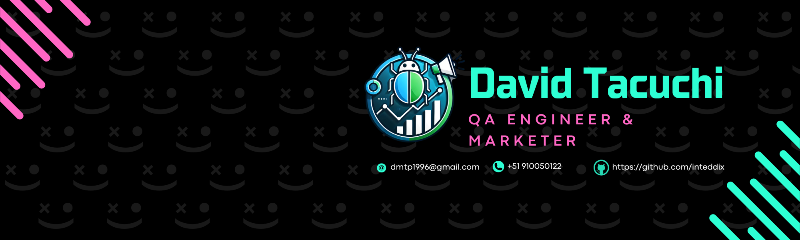

<h1 align="center">Hi 👋, I'm David</h1>
<h3 align="center">A passionate QA Engineer from Peru</h3>

- 🔭 I’m currently working on **Urban Routes**

- 🌱 I’m currently enrolled in a **QA Engineer Bootcamp at Tripleten**

- 📫 How to reach me **dmtp1996@gmail.com**

- ⚡ Fun fact **I'm trying to be a LoL player**

<h3 align="left">Connect with me:</h3>

<h3 align="left">Languages and Tools:</h3>

    

<!--
**inteddix/inteddix** is a ✨ _special_ ✨ repository because its `README.md` (this file) appears on your GitHub profile.

Here are some ideas to get you started:

- 🔭 I’m currently working on ...
- 🌱 I’m currently learning ...
- 👯 I’m looking to collaborate on ...
- 🤔 I’m looking for help with ...
- 💬 Ask me about ...
- 📫 How to reach me: ...
- 😄 Pronouns: ...
- ⚡ Fun fact: ...
-->
